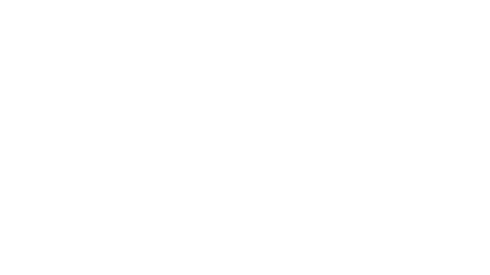
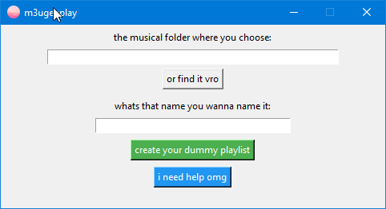
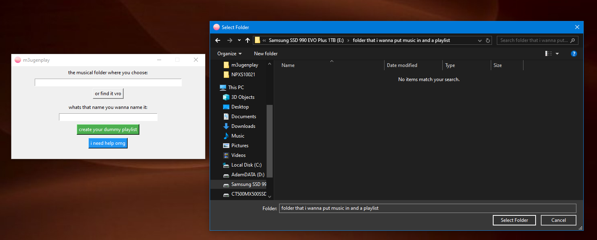
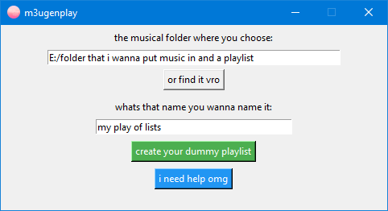
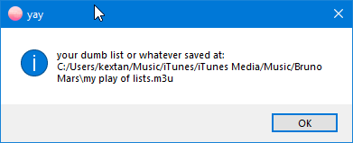

# 
converts folders of songs to m3u file for ps3, psp, psvita

# how does it work
oh it works by taking your folders of music and converts them into a m3u for youre ps3, psp, psvita 

# how to use 
do you have a folder full of 7,142 audio files from 2008 to 2023 and no clue what’s even in there anymore?  
do you desperately want to feel productive without actually doing anything?

introducing **m3ugenplay**:  
a small, cursed `.m3u` playlist generator made with more sarcasm than actual code.

---

## 🖼️ visual tutorial because reading is hard

### step 1: open the app (aka press things randomly)


you're greeted by what looks like a windows 98 prank app. that’s the gui. it’s not gonna get better.

---

### step 2: choose the musical folder™  
click the button that says something like “or find it vro”. it’s not lying.  
pick a folder full of `.mp3`, `.wav`, or whatever other audio chaos you downloaded from thepiratebay in 2009.



---

### step 3: name your playlist like it’s 2012  
type anything. “sadboiszn.m3u”. “bussin_beats”. “projectxbutworse”.  
you do you.



---

### step 4: click the green button and pray  
you know the one — it says "create your dummy playlist".  
click it. then don’t touch anything. it might be doing something. or not.



---

### step 5: celebrate. or don’t.  
congrats. your playlist is now in that same folder.  
no fanfare. no confetti. just a `.m3u` file that probably works.


---

## 💡 features (if you can call them that)
- accepts `.mp3`, `.wav`, `.flac`, `.ogg`, `.m4a` because variety is pain.
- saves playlists in the same place your music lives — no fancy directories here.
- includes passive-aggressive error messages for motivation.
- has a help button that just insults you more.

---

## ⚙️ how to run it (the not-funny part)

### if you hate python:
just download the `.exe` from [releases](#) and double-click it poopy

### if you're a nerd™:
```bash
pip install pyinstaller
pyinstaller --noconsole --onefile --icon=icon.ico m3ugenplay.py
